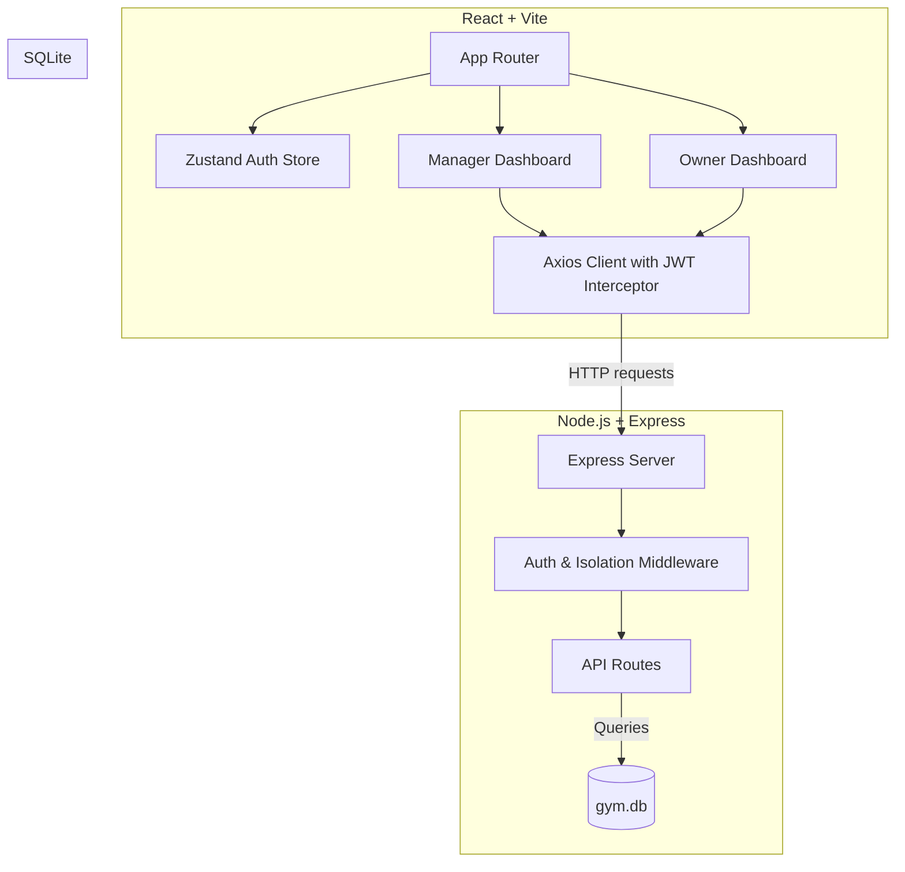
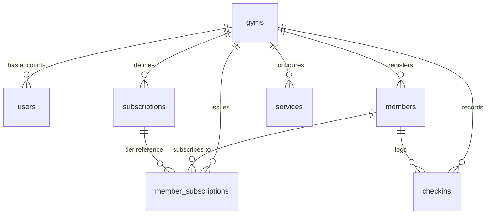

# Gym Management SaaS MVP — Deep Technical Analysis

A comprehensive audit and architecture analysis of the Gym Management SaaS platform designed for fitness facilities in East Africa (MVP instance modeled on Kigali, Rwanda).

---

## 1. Executive Summary
The project is a lightweight, role-based, multi-tenant operational and analytical system for local fitness gyms. It isolates data between gyms using a single SQLite database with strict `gym_id` column filters.
The application supports two distinct roles:
1. **Managers (On-site staff)**: Operational check-ins (via name search or simulated QR codes), dynamic member registrations with coupon code discounts, walk-in cash logging, and renewal tracking.
2. **Owners (Remote management)**: Analytical monitoring (revenue breakdowns, active member logs, timeline trend charts) and core service catalogue management.

The system is organized as a unified **Node.js/React monorepo** with clean separation of layers and custom styling.

---

## 2. Architecture & Tech Stack



### Technology Matrix
* **Monorepo Structure**: Managed via npm workspaces (`backend` and `frontend` packages). Run simultaneously in development using the `concurrently` package.
* **Backend**: Node.js + Express with native SQLite drivers (`sqlite` + `sqlite3`). Fast startup, low footprint, and simple file-based portability.
* **Frontend**: React + Vite, utilizing Zustand for lightweight client state (auth store) and Axios for API communications.
* **Styling**: Pure Vanilla CSS (`app.css`, `login.css`, `dashboard.css`, `layout.css`, `modal.css`) avoiding bulky frameworks, optimized for high responsiveness and sleek UI layout.
* **Data Isolation**: Implemented via custom middleware (`gymIsolationMiddleware`) dynamically enforcing tenant-level security.

---

## 3. Database Schema & Data Model

The database runs on SQLite (`backend/src/db/gym.db`). It implements a clean relational schema to support multi-tenancy, member subscription lifecycles, walk-ins, and dynamic services.

### Entity Relationship Diagram


### Database Tables Specification

| Table | Primary Key | Critical Foreign Keys | Unique Constraints & Indexing | Purpose |
| :--- | :--- | :--- | :--- | :--- |
| **`gyms`** | `id` (UUID) | None | None | Tracks all gyms (supports future multi-gym enterprise panel). |
| **`users`** | `id` (UUID) | `gym_id` | `email` (Unique) | Auth details for Managers & Owners. |
| **`members`** | `id` (UUID) | `gym_id` | `(gym_id, email)`, `(gym_id, qr_code_id)` | Scoped members records with associated QR code identifiers. |
| **`subscriptions`** | `id` (UUID) | `gym_id` | `(gym_id, name)` | Subscription tiers (fixed packages e.g. "40k Gym Only" & dynamic bundles). |
| **`member_subscriptions`** | `id` (UUID) | `gym_id`, `member_id`, `subscription_id` | None | Tracks subscription state (`active`, `expired`), card flags, and tap counts. |
| **`services`** | `id` (UUID) | `gym_id` | `(gym_id, name)` | Available gym resources (e.g. gym, sauna, pool) with daily and monthly rates. |
| **`checkins`** | `id` (UUID) | `gym_id`, `member_id` | Index: `(gym_id, timestamp)` | Activity log for members (active subscriptions) and guest walk-ins. |

---

## 4. Security & Isolation Model

### JWT Authentication
Authentication is stateless and handled via JSON Web Tokens:
* A Bearer token is returned on successful `POST /api/auth/login`.
* The token is cached in `localStorage` by the frontend.
* An Axios request interceptor automatically attaches the token to the `Authorization` header for all requests.

### Role-Based Access Control (RBAC)
Strict role controls are enforced on the backend via the `roleMiddleware` decorator.
* **Manager Actions**: Register members, search members, scan QRs, log check-ins, view today's operations list, and renew subscriptions.
* **Owner Actions**: Query longitudinal analytics (snapshots for today/week/month/year), track 7-day trend metrics, retrieve revenue breakdowns, view absolute member list, and perform CRUD operations on gym services.

### Multi-Tenant Isolation
Gym data security is robustly designed at the API boundary using `gymIsolationMiddleware`:
```javascript
export function gymIsolationMiddleware(req, res, next) {
  const requestGymId = req.body.gym_id || req.query.gym_id || req.params.gym_id;
  
  if (requestGymId && requestGymId !== req.user.gym_id) {
    return res.status(403).json({ error: 'Unauthorized: gym_id mismatch' });
  }

  if (!req.body.gym_id && req.method !== 'GET') {
    req.body.gym_id = req.user.gym_id;
  }

  next();
}
```
* **Strict Comparison**: Restricts cross-tenant queries by verifying request inputs against the token payload.
* **Automatic Injection**: Inserts `gym_id` on state-modifying requests so users never need to specify their gym context.

---

## 5. Functional & Architecture Gaps (MVP Review)

While the project has an elegant and clean codebase, several architectural gaps exist that must be solved before standard production deployment:

> [!WARNING]
> **1. QR Scanner is a Frontend Placeholder**
> The current front-end implementation depends on a text input to input a UUID string for QR check-ins. Teammates must integrate an in-browser scanner library (e.g., `html5-qrcode` or `jsQR`) to read live camera frames.

> [!IMPORTANT]
> **2. Concurrency Issues with SQLite**
> SQLite works flawlessly for simple local workloads but blocks writes when concurrent write queries are executed. Moving to a standard Postgres instance (which is already configured in the `.env` template) is recommended for cloud deployments.

> [!NOTE]
> **3. Single-Daily Check-in Constraint**
> In `backend/src/api/checkins.js` (line 73-81), subscribers are locked to one check-in per day:
> ```javascript
> const existingCheckin = await db.get(
>   `SELECT id FROM checkins WHERE member_id = ? AND DATE(timestamp) = ?`,
>   [member_id, today]
> );
> if (existingCheckin) {
>   return res.status(400).json({ error: 'Member has already checked in today.' });
> }
> ```
> While this prevents members from sharing QR codes with friends, it could block a user returning to the gym for an evening class after a morning workout.

---

## 6. Recommendations & Roadmap

### Phase 1: Polish & QR Integration (Short Term)
1. **Camera-Based QR Scanner**: Replace the raw UUID text input in the frontend with a scanner overlay using the browser's user-media permissions.
2. **First-Login Password Policy**: Emphasize first-login modal styles to ensure passwords are changed securely right away (already fully supported in backend API via `first_login` database field).

### Phase 2: Production Readiness (Mid Term)
1. **PostgreSQL Migration**: Swap the SQLite driver in `backend/src/db/init.js` with `pg` (PostgreSQL) as planned in `.env`.
2. **Mobile Money Payment Integration**: Integrate standard East African payment APIs (like MTN MoMo / Airtel Money) directly into the dynamic member registration flow to track card payments digitally.

### Phase 3: Advanced Features (Long Term)
1. **Platform Admin Panel**: Create a global dashboard to monitor subscriptions, register new gyms, and track system-wide analytics.
2. **Class Scheduling**: Add scheduling capabilities to allow members to book specific spin classes or gym slots.
